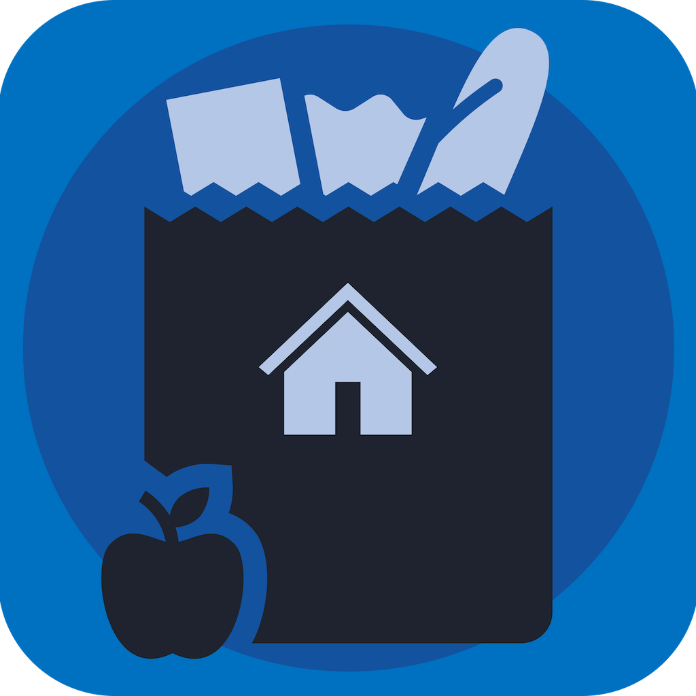
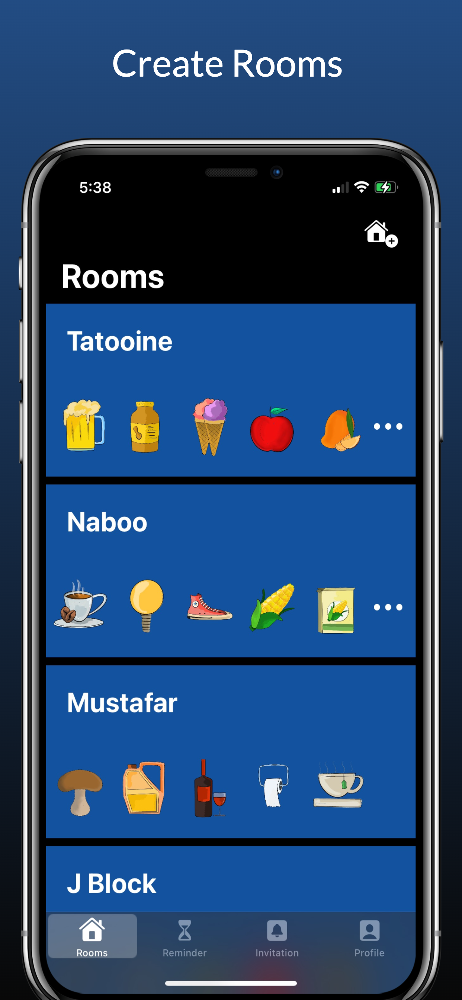
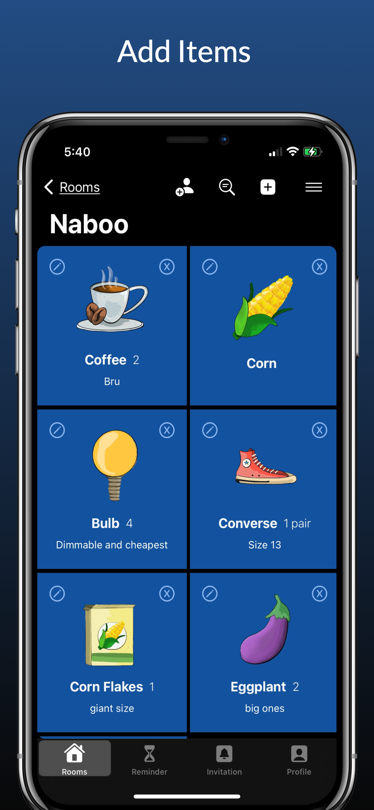
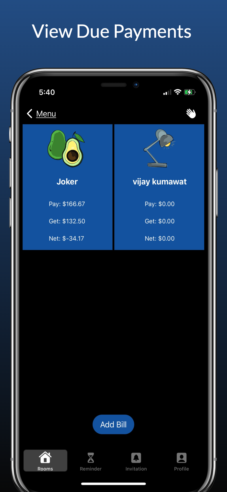
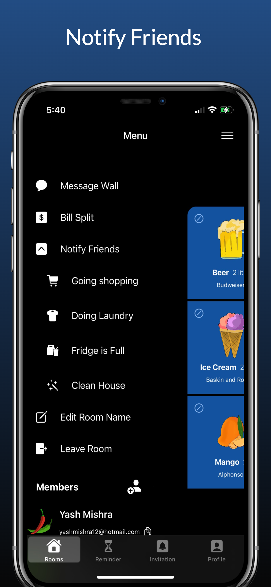
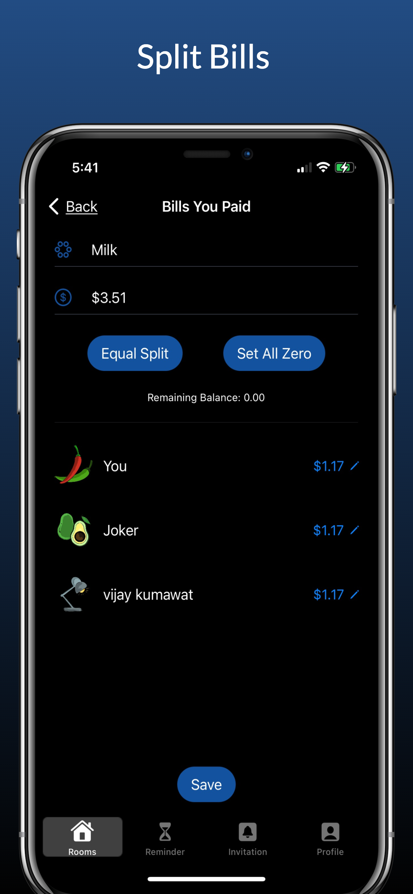
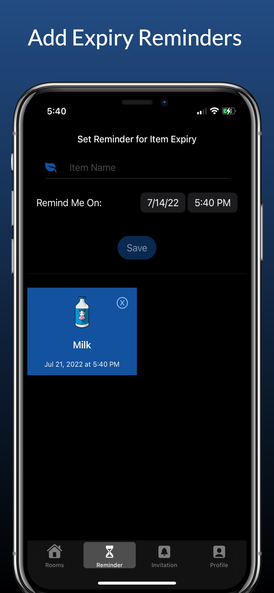
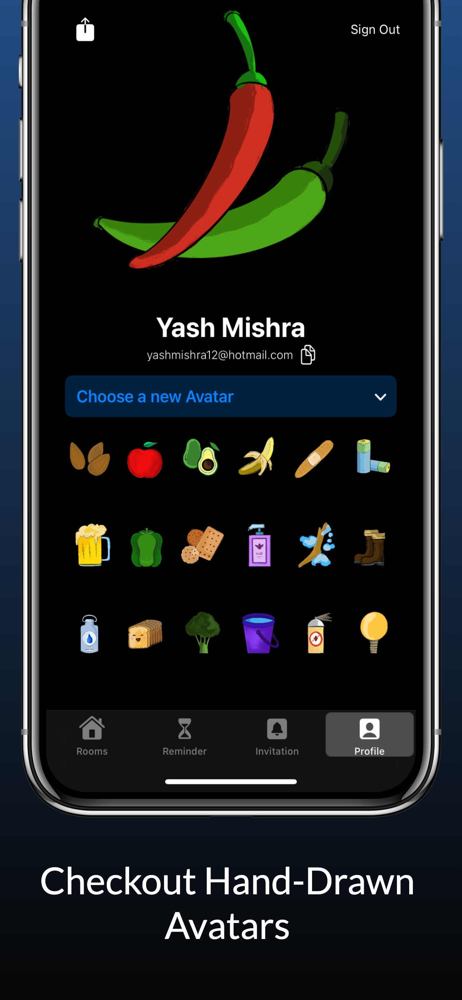
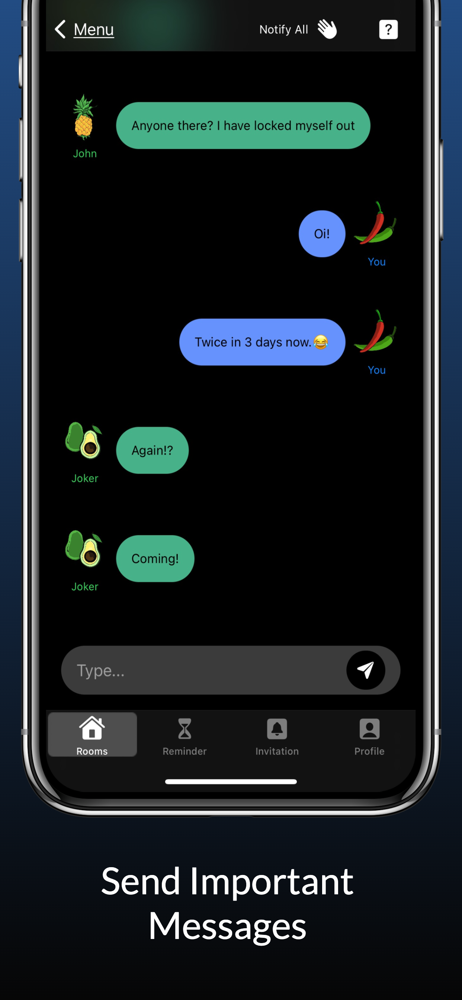

 

 

# Leyaa

Leyaa helps people living under the same roof communicate better. Unorganized shopping sprees will be a thing of the past. Team up with your flatmates to clean the house and so much more. Stop jumping apps and split your bills at the same place.

## Demo

 

## Screenshots

<table style = "margin-left: auto; margin-right auto;">
  <tr>
    <td>  </td>
    <td>  </td>
    <td>  </td>
    <td>  </td>
  </tr>
  
  <tr>
    <td>  </td>
    <td>  </td>
    <td>  </td>
    <td>  </td>
  </tr>
  
 </table>

## Features

- Create Rooms and send an invitation request to existing Leyaa users.
- Add items that the house for all to see.
- Notify room members when you go shopping so that they can add items.
- Set reminders to check on items that can go stale
- Tell them when it's time to clean the house.
- Easily split your bill and send important posts.

